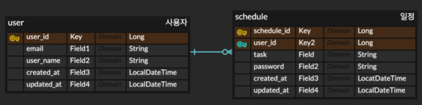

# 카카오테크캠퍼스 BE 1단계 - 2차 과제

**작성자 정보**  
트랙 : Backend  
이름 : 유우석  

# 1. API 명세서

## 📘 일정 API 명세 (Schedule API)

| 기능       | Method | URL                       | Request                                      | Response                | 상태코드          |
| -------- | ------ | ------------------------- | -------------------------------------------- | ----------------------- | ------------- |
| 일정 등록    | POST   | `/schedule/create`        | `@RequestBody` ScheduleRequest               | 없음                      | `201 Created` |
| 일정 목록 조회 | GET    | `/schedule`               | `@RequestParam` updatedAt, email, page, size | Page\<ScheduleResponse> | `200 OK`      |
| 일정 단건 조회 | GET    | `/schedule/{schedule_id}` | `@PathVariable` schedule\_id                 | ScheduleResponse        | `200 OK`      |
| 일정 수정    | PUT    | `/schedule/{schedule_id}` | `@RequestBody` ScheduleUpdateRequest         | 없음                      | `200 OK`      |
| 일정 삭제    | DELETE | `/schedule/{schedule_id}` | `@RequestBody` ScheduleDeleteRequest         | 없음                      | `200 OK`      |

---

## 📦 @RequestBody DTO 구조 설명

---

### 1. 📌 `ScheduleDeleteRequest`

| 필드명      | 타입     | 제약 조건       | 설명        |
| -------- | ------ | ----------- | --------- |
| password | String | `@NotBlank` | 비밀번호 (필수) |

---

### 2. 📌 `ScheduleRequest` (일정 등록 요청)

| 필드명      | 타입     | 제약 조건                           | 설명                  |
| -------- | ------ | ------------------------------- | ------------------- |
| email    | String | `@NotBlank`, `@Email`           | 담당자 이메일 (필수)        |
| task     | String | `@NotBlank`, `@Size(max = 200)` | 할일 내용 (필수, 최대 200자) |
| password | String | `@NotBlank`                     | 비밀번호 (필수)           |

---

### 3. 📌 `ScheduleUpdateRequest` (일정 수정 요청)

| 필드명        | 타입     | 제약 조건                           | 설명              |
| ---------- | ------ | ------------------------------- | --------------- |
| task       | String | `@NotBlank`, `@Size(max = 200)` | 수정할 할일 (필수)     |
| password   | String | `@NotBlank`                     | 비밀번호 (필수)       |
| user\_name | String | 없음                              | 수정할 사용자 이름 (선택) |
| email      | String | `@NotBlank`, `@Email`           | 이메일 (필수)        |

---

### 4. 📌 `ScheduleResponse` (일정 조회 응답)

| 필드명         | 타입            | 설명     |
| ----------- | ------------- | ------ |
| user\_name  | String        | 담당자 이름 |
| task        | String        | 할일 내용  |
| created\_at | LocalDateTime | 생성일시   |
| updated\_at | LocalDateTime | 수정일시   |

---

### 5. 📌 `UserRequest`

| 필드명      | 타입     | 제약 조건                 | 설명           |
| -------- | ------ | --------------------- | ------------ |
| username | String | 없음                    | 사용자 이름 (선택)  |
| email    | String | `@NotBlank`, `@Email` | 사용자 이메일 (필수) |

---

---

# 2. ERD 작성

